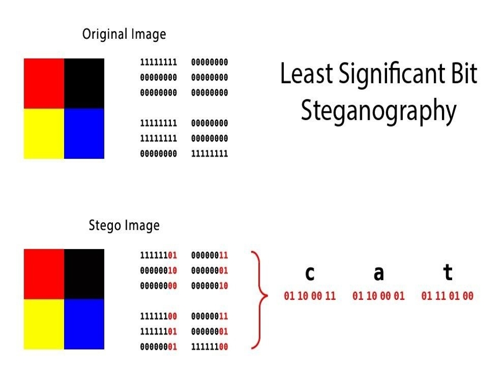

# Image Steganography and Steganalysis

## Description

This project implements both **steganography** and **steganalysis** techniques for digital images. Steganography is the practice of concealing information within other non-secret data, while steganalysis is the study of detecting hidden information.

### What is Steganography?
Steganography allows you to hide secret messages, files, or data within digital images without visibly altering the appearance of the cover image. This technique provides a covert communication channel where the existence of the hidden message is not apparent to casual observers.

### What is Steganalysis?
Steganalysis is the art and science of detecting hidden information within digital media. It involves analyzing images to determine whether they contain concealed data and potentially extracting that hidden information.

## LSB Steganography Method

This project implements the **Least Significant Bit (LSB)** steganography technique, which is one of the most popular and widely used methods for hiding data in digital images.

### How LSB Steganography Works

LSB steganography works by replacing the least significant bits of pixel values in an image with bits from the secret message

## LSB Variants and Parameters

This project implements **112 different LSB variants** by varying the following parameters:

### 1. **Start Position**
- **Random starting pixel**: Message embedding begins at different positions
- **Sequential embedding**: Bits are embedded consecutively from start position
- **Purpose**: Increases security by avoiding predictable patterns

### 2. **Color Channels**
- **RGB**: Use all three color channels
- **R only**: Use only Red channel
- **G only**: Use only Green channel  
- **B only**: Use only Blue channel
- **Impact**: Different channels may have varying detection rates

### 3. **Number of Bits (LSB1 to LSB8)**
- **LSB1**: Modify only 1 least significant bit
- **LSB2**: Modify 2 least significant bits
- **LSB8**: Modify up to 8 least significant bits
- **Trade-off**: Higher bits = more capacity but more distortion

### 4. **Gap Parameter**
- **Gap=1**: Embed in consecutive pixels
- **Gap=5**: Skip 4 pixels between embeddings
- **Gap=6**: Skip 5 pixels between embeddings
- **Advantage**: Spreads message across image for better concealment

### 5. **Direction**
- **Horizontal**: Process pixels row by row
- **Vertical**: Process pixels column by column
- **Pattern**: Affects embedding sequence and detection difficulty(future work)

### Applications in This Project:
- Text message hiding in PNG/BMP images
- File embedding within image containers
- Steganalysis detection of LSB-based steganography
- Performance analysis of LSB technique effectiveness

## Team Members

**G. Sai Rohith (142201019)**

**M. Rahul (142201022)**
